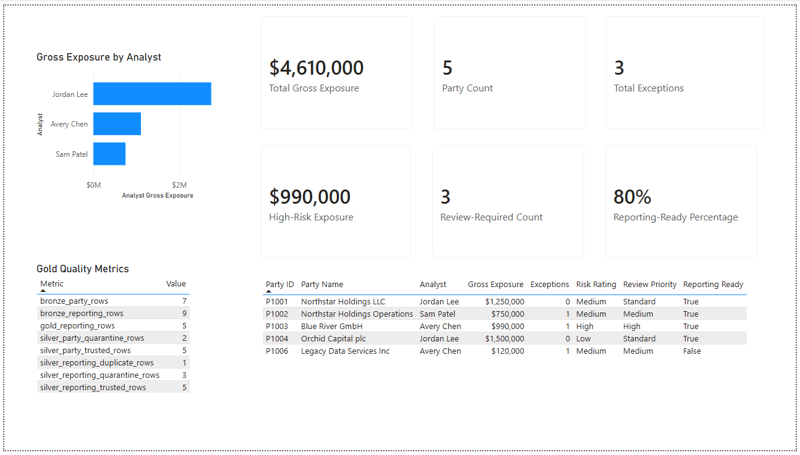

# Databricks GLEIF Lakehouse & Access Modernization Lab

An end-to-end data-engineering portfolio project using Databricks, PySpark,
Spark SQL, Delta Lake, Lakeflow Jobs, Python, pandas, Power BI, and DAX.

The repository contains two completed, production-inspired Databricks workflows
and a completed downstream reporting layer:

1. A GLEIF legal-entity lakehouse pipeline
2. A representative Microsoft Access modernization pipeline
3. A Power BI reporting and validation layer connected to Databricks Gold tables

Together, these components demonstrate layered lakehouse processing,
data-quality controls, business-grain analysis, exception handling,
analytical dataset delivery, Delta auditing, workflow orchestration,
semantic measures, refreshable reporting, and cross-platform validation.

## Project Status

✅ GLEIF Bronze, Silver, Gold, Delta audit, and Lakeflow workflow completed

✅ Access modernization Bronze, Silver, Gold, and Lakeflow workflow completed

✅ Power BI semantic measures, dashboard, Databricks refresh, and reconciliation completed

---

# Workflow 1: GLEIF Legal-Entity Lakehouse

This workflow processes a controlled sample of Global Legal Entity Identifier
Foundation reference data.

## GLEIF Architecture

    GLEIF CSV source
           |
           v
    Bronze ingestion
           |
           v
    Silver transformation
       |          |
       v          v
    Quarantine   Duplicate audit
           |
           v
    Gold analytics
           |
           v
    Delta history audit

Detailed architecture and technology responsibilities:

- [Lakehouse architecture](docs/architecture.md)

## GLEIF Processing Layers

### Bronze — Raw / Staging

- Ingests the controlled GLEIF sample
- Preserves source values and quality issues
- Adds source-system and ingestion metadata
- Persists the data as a Delta table

### Silver — Standardized / Intermediate

- Standardizes text and date values
- Applies validation and quality flags
- Separates trusted, quarantined, and duplicate-audit records
- Preserves questionable records for traceability rather than silently
  discarding them

### Gold — Business-Ready / Reporting Mart

Creates three analytical Delta tables:

- `gold_gleif_entity_reporting`
- `gold_gleif_status_summary`
- `gold_gleif_quality_metrics`

The Gold outputs provide entity-level reporting, status summaries, and
pipeline-reconciliation metrics suitable for downstream analytical use.

## GLEIF Lakeflow Job

The workflow runs four dependent notebook tasks:

1. `bronze_ingestion`
2. `silver_transformation`
3. `gold_analytics`
4. `delta_history_audit`

Each task runs only after its upstream dependency succeeds.

The job uses serverless autoscaling compute, queueing, and a maximum of one
concurrent run to prevent overlapping executions.

A validated manual run completed successfully in approximately 1 minute
46 seconds.

## GLEIF Validation Results

The controlled source contains six records:

| Result Category | Rows |
|---|---:|
| Trusted Silver records | 4 |
| Quarantined records | 1 |
| Duplicate audit records | 1 |
| Reconciled source rows | 6 |

The pipeline reconciles completely:

`4 trusted + 1 quarantined + 1 duplicate = 6 source rows`

Execution evidence:

- [Medallion validation results](docs/validation/medallion-results.md)
- [Lakeflow Job validation results](docs/validation/lakeflow-job-results.md)

## GLEIF Business-Grain Consideration

Repeated LEIs are identified for demonstration and audit purposes, but a
repeated LEI is not automatically a business duplicate.

In a production party-data model, multiple internal party records may
legitimately map to the same legal entity. A production design would commonly
separate:

1. Legal entities at one row per LEI
2. Internal parties at one row per party identifier
3. Party-to-LEI relationships

Deduplication and quality rules must therefore follow the intended business
grain.

## GLEIF Notebooks

- [Exploration](notebooks/00_gleif_entity_matching_exploration.py)
- [Bronze ingestion](notebooks/01_bronze_ingestion.py)
- [Silver transformation](notebooks/02_silver_transformation.py)
- [Gold analytics](notebooks/03_gold_analytics.py)
- [Delta history audit](notebooks/04_delta_history_audit.py)

---

# Workflow 2: Microsoft Access Modernization Prototype

This workflow demonstrates how representative Microsoft Access reporting
patterns can be translated into a governed Databricks lakehouse pipeline.

It is not presented as a production migration. It is a focused prototype that
maps established Access, SQL, ETL, reporting, and operational-control patterns
into Databricks, Delta Lake, and Lakeflow Jobs.

## Access Modernization Architecture

    Access-style CSV exports
              |
              v
       Bronze ingestion
              |
              v
      Silver transformation
       |        |        |
       v        v        v
    Trusted  Quarantine  Audit
              |
              v
        Gold reporting
              |
              v
       Lakeflow Jobs
              |
              v
       Power BI reporting

## Representative Sources

- `data/sample/access_modernization/party_master_export.csv`
- `data/sample/access_modernization/monthly_reporting_export.csv`

The synthetic datasets intentionally include:

- two internal parties sharing one LEI
- a missing party name
- a malformed LEI
- two submissions for the same monthly reporting business key
- reporting records that cannot join to the trusted party master

## Access Bronze Layer

Bronze preserves the exported values and adds:

- source-file metadata
- source-system metadata
- ingestion timestamps

Source counts:

| Dataset | Rows |
|---|---:|
| Party master | 7 |
| Monthly reporting | 9 |

## Access Silver Layer

Silver replaces the kinds of chained validation, totals, exception, and
latest-record queries often implemented in Access.

It performs:

- field trimming and standardization
- date, timestamp, integer, and decimal conversion
- party-master validation
- quarantine routing with explicit reasons
- latest-submission selection
- superseded-submission preservation
- referential-integrity validation
- source-to-outcome reconciliation

### Party-Master Reconciliation

| Outcome | Rows |
|---|---:|
| Trusted | 5 |
| Quarantined | 2 |
| Reconciled | 7 |

### Monthly-Reporting Reconciliation

| Outcome | Rows |
|---|---:|
| Trusted | 5 |
| Quarantined | 3 |
| Superseded-submission audit | 1 |
| Reconciled | 9 |

Two distinct party IDs sharing one LEI remain valid because the party-master
grain is one row per internal party, not one row per legal entity.

For repeated monthly submissions, the newest `source_updated_at` record is
retained while the older record remains available for audit.

## Access Gold Layer

The Gold layer produces:

- party-level reporting detail
- analyst-level exposure and exception summaries
- portfolio-level control totals
- pipeline quality metrics
- review-priority classifications
- reporting-readiness indicators

Validated Gold counts:

| Dataset | Rows |
|---|---:|
| Gold party reporting | 5 |
| Gold analyst summary | 3 |
| Gold portfolio summary | 1 |
| Gold quality metrics | 8 |

## Access Modernization Lakeflow Job

The workflow runs three dependent notebook tasks:

1. `bronze_ingestion`
2. `silver_transformation`
3. `gold_reporting`

A manually launched serverless run completed successfully:

| Task | Status | Duration |
|---|---|---:|
| Bronze ingestion | Succeeded | 28 seconds |
| Silver transformation | Succeeded | 37 seconds |
| Gold reporting | Succeeded | 30 seconds |
| Total workflow | Succeeded | 1 minute 36 seconds |

Databricks reported seven upstream tables and seven downstream tables for the
successful run.

## Access Modernization Notebooks

- [Bronze ingestion](notebooks/05_access_bronze_ingestion.py)
- [Silver transformation](notebooks/06_access_silver_transformation.py)
- [Gold reporting](notebooks/07_access_gold_reporting.py)

## Access Modernization References

- [Access modernization mapping](docs/access-modernization-mapping.md)
- [Access pipeline validation](docs/validation/access-modernization-results.md)
- [Power BI dashboard validation](docs/validation/power-bi-results.md)

---

# Power BI Reporting and Validation Layer

Power BI Desktop connects directly to the Databricks SQL warehouse using
OAuth authentication.

The report uses Import mode, which stores an analytical model copy locally
while retaining the Databricks connection for future refreshes.

## Databricks Gold Tables Used

The Power BI report imports four Access-modernization Gold tables:

- `gold_party_reporting`
- `gold_analyst_summary`
- `gold_portfolio_summary`
- `gold_quality_metrics`

Each table serves a distinct reporting grain and purpose.

### `gold_party_reporting`

Contains one row per trusted internal party and supports:

- executive KPI measures
- party-level traceability
- analyst ownership
- gross exposure
- exception counts
- risk classifications
- review priorities
- reporting-readiness status

### `gold_analyst_summary`

Contains aggregated analyst-level results and supports comparison of portfolio
exposure and operational workload by analyst.

### `gold_portfolio_summary`

Contains a single portfolio-level control row used to validate executive totals
produced in the Databricks Gold layer.

### `gold_quality_metrics`

Contains eight named pipeline-quality and reconciliation controls displayed
alongside the report outputs.

## Semantic Model Decision

Power BI automatically proposed a relationship between:

- `gold_analyst_summary[analyst_name]`
- `gold_party_reporting[analyst_name]`

The relationship was removed intentionally.

`gold_analyst_summary` is an aggregated reporting output rather than a true
analyst dimension. Directly relating the aggregate table to party-level detail
could create ambiguous filtering or double-counting.

For this validation-focused prototype, the Gold outputs remain disconnected so
each visual operates at its intended reporting grain.

A broader production semantic model could introduce conformed analyst, party,
and date dimensions when coordinated cross-filtering is required.

## Explicit DAX Measures

The report uses named DAX measures rather than relying only on Power BI's
implicit aggregations.

### Total Gross Exposure

Sums gross exposure across the trusted party population.

Validated result: **$4,610,000**

### Total Exceptions

Sums exceptions across trusted parties.

Validated result: **3**

### Party Count

Calculates the distinct number of trusted party IDs.

Validated result: **5**

### High-Risk Exposure

Calculates gross exposure for parties classified as High risk.

Validated result: **$990,000**

### Review-Required Count

Counts trusted parties requiring exception review.

Validated result: **3**

### Reporting-Ready Percentage

Divides reporting-ready trusted parties by the total trusted-party population.

Validated result: **80%**

### Analyst Gross Exposure

Explicitly sums analyst-level gross exposure from `gold_analyst_summary`.

This replaces Power BI's automatically generated `Sum of` aggregation with a
named and governed business measure.

## Dashboard Areas

### Executive KPI Cards

Six KPI cards summarize the trusted reporting population:

- total gross exposure
- total exceptions
- party count
- high-risk exposure
- review-required count
- reporting-ready percentage

The cards are not manually entered values. Each is driven by a defined DAX
business rule.

### Gross Exposure by Analyst

A horizontal bar chart compares analyst-level gross exposure.

Validated analyst totals:

| Analyst | Gross Exposure |
|---|---:|
| Jordan Lee | $2,750,000 |
| Avery Chen | $1,110,000 |
| Sam Patel | $750,000 |

### Party-Level Validation Detail

The party-detail table displays the five trusted records underlying the KPI
results.

It provides traceability for:

- Party ID
- Party Name
- Analyst
- Gross Exposure
- Exceptions
- Risk Rating
- Review Priority
- Reporting Ready

The visible detail values reconcile to the dashboard totals.

### Gold Quality Metrics

The quality table exposes all eight named Gold validation controls without
aggregating their values.

This keeps pipeline-quality evidence visible beside the operational reporting
results.

## Power BI Reconciliation Results

Power BI matches the validated Databricks Gold outputs:

| Metric | Validated Result |
|---|---:|
| Trusted parties | 5 |
| Total gross exposure | $4,610,000 |
| Total exceptions | 3 |
| High-risk exposure | $990,000 |
| Review-required parties | 3 |
| Reporting-ready parties | 4 of 5 |
| Reporting-ready percentage | 80% |

## Refresh Validation

A manual Power BI refresh successfully:

- reconnected through OAuth
- started the stopped Databricks SQL warehouse
- evaluated all four Gold queries
- reloaded the imported model
- preserved the validated dashboard totals
- completed without a reported error

This confirms that the report is backed by refreshable Databricks Gold outputs
rather than a static exported file.

## Final Dashboard

## Power BI Artifacts

- [Power BI validation details](docs/validation/power-bi-results.md)
- [Power BI Desktop report](power-bi/access-modernization-dashboard.pbix)

---

# Technology Stack

- Databricks
- Lakeflow Jobs
- PySpark
- Spark SQL
- Delta Lake
- Python
- pandas
- Power BI Desktop
- DAX
- OAuth
- Git
- GitHub
- Microsoft Access modernization concepts

# Technology Responsibilities

| Technology | Responsibility |
|---|---|
| Databricks | Workspace, serverless compute, catalog, notebooks, SQL warehouse, and jobs |
| Python | Notebook control flow and configuration |
| pandas | Small local DataFrame processing for demonstration sources |
| PySpark | Distributed transformation, validation, and metadata handling |
| Spark SQL | Table creation, aggregation, control queries, and analytical SQL |
| Delta Lake | Transactional storage, persisted layers, versioning, and history |
| Lakeflow Jobs | Task dependencies, execution order, monitoring, and concurrency control |
| Power BI | Semantic measures, visual reporting, refresh, and result presentation |
| DAX | Named business measures and filter-aware analytical calculations |
| Git and GitHub | Version control, documentation, and portable project evidence |

# Repository Guide

| Path | Purpose |
|---|---|
| `data/sample/` | Controlled synthetic source datasets |
| `notebooks/` | Databricks notebook source files |
| `power-bi/` | Power BI Desktop report artifact |
| `docs/architecture.md` | Lakehouse architecture and technology responsibilities |
| `docs/access-modernization-mapping.md` | Access-to-Databricks translation reference |
| `docs/validation/` | Execution, reconciliation, workflow, and Power BI evidence |
| `docs/images/power-bi/` | Curated final Power BI dashboard image |

# Legacy-to-Lakehouse Translation

The architecture translates familiar enterprise data-processing patterns into
the Databricks and Power BI ecosystem:

- Raw tables and staging loads → Bronze
- Intermediate queries and transformation tables → Silver
- Reporting tables and marts → Gold
- Exception reports → Quarantine and audit tables
- Stacked SQL criteria logic → PySpark and Spark SQL business rules
- Manual control totals → Automated reconciliation metrics
- Scheduled process chains → Lakeflow Job dependencies
- Custom runtime logs → Databricks graph, timeline, task history, and lineage
- Access and Excel reporting outputs → Power BI semantic measures and visuals
- Manual report comparisons → Databricks-to-Power BI reconciliation

# What This Demonstrates

This project demonstrates how legacy reporting and operational-control patterns
can be translated into a governed cloud data platform without discarding the
business logic that made the original processes valuable.

The GLEIF workflow demonstrates:

- medallion architecture
- business-grain analysis
- quarantine and audit handling
- analytical Gold delivery
- Delta history inspection
- Lakeflow orchestration

The Access-modernization workflow demonstrates:

- preservation of representative legacy exports
- validation and referential-integrity controls
- latest-record selection
- superseded-record auditing
- quarantine routing
- reporting-readiness logic
- operational reconciliation

The Power BI layer demonstrates:

- direct connection to a Databricks SQL warehouse
- OAuth-based authentication
- explicit DAX business measures
- reporting-grain awareness
- model-relationship review
- dashboard-to-Gold reconciliation
- refreshable downstream reporting

Together, the completed workflows show how Access-style processes can evolve
into a traceable Databricks pipeline with Power BI serving as the governed
reporting and validation layer.

# Potential Extensions

Potential future improvements include:

- introducing conformed party, analyst, and date dimensions
- adding automated data-quality test thresholds
- scheduling recurring Lakeflow runs
- publishing the Power BI model to a governed workspace
- configuring managed Power BI refresh
- adding incremental processing for larger datasets
- expanding the controlled source data
- implementing additional exception and risk measures
- adding environment-specific configuration
- introducing deployment automation